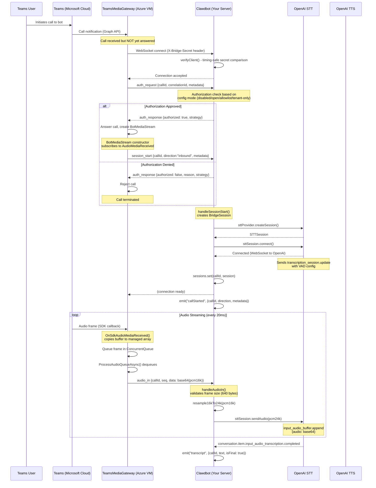
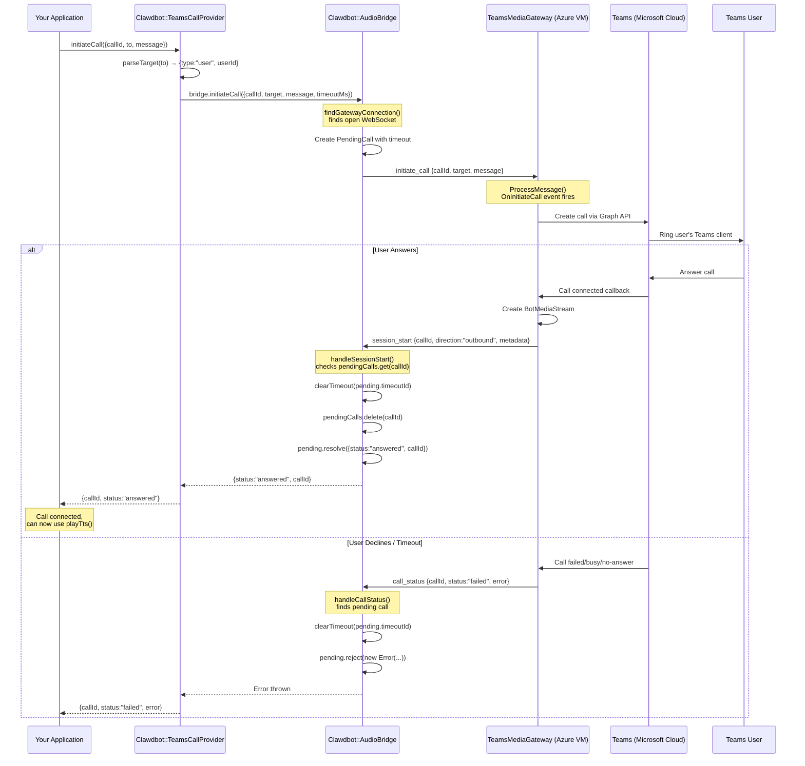
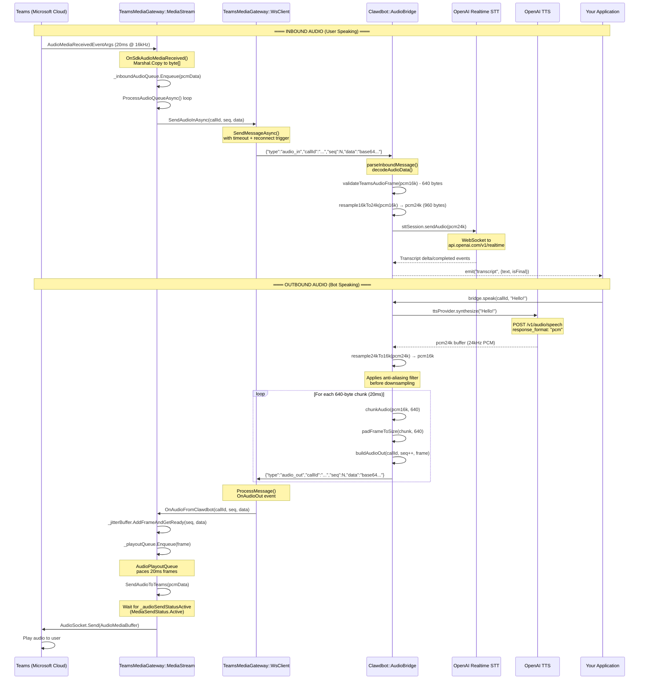
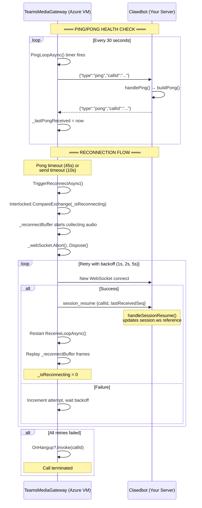

# MS Teams Voice Call

Status: ready for inbound and outbound voice calls via Microsoft Teams.

The Teams voice extension lets Clawdbot answer and make phone calls through your organization's Teams tenant. It uses OpenAI for speech transcription (STT) and synthesis (TTS).

## Quick setup

1. Deploy the [TeamsMediaGateway](../../../TeamsMediaGateway/README.md) to an Azure Windows VM
2. Configure the bridge secret (same value in both configs)
3. Set your OpenAI API key
4. Start the gateway

Minimal config:
```json5
{
  plugins: {
    entries: {
      "msteams-call": {
        enabled: true,
        config: {
          bridge: {
            // Generate with: openssl rand -base64 32
            secret: "your-32-char-minimum-shared-secret"
          }
        }
      }
    }
  }
}
```

If your OpenAI key is not already configured, add it:
```json5
{
  plugins: {
    entries: {
      "msteams-call": {
        enabled: true,
        config: {
          bridge: { secret: "your-32-char-minimum-shared-secret" },
          streaming: { openaiApiKey: "sk-..." }
        }
      }
    }
  }
}
```

## How it works

1. User calls your bot in Teams (or bot calls user)
2. TeamsMediaGateway (C# on Azure) receives the call via Microsoft Graph SDK
3. Gateway connects to Clawdbot via WebSocket, streaming audio as base64 JSON
4. **Gateway sends `auth_request` to Clawdbot BEFORE answering the call**
5. **Clawdbot performs config-driven authorization check and responds with `auth_response`**
6. If authorized, gateway answers the call; if not, call is rejected
7. Clawdbot resamples audio (16kHz to 24kHz) and pipes it to OpenAI Realtime STT
8. When the user stops speaking, STT emits a transcript
9. Your application generates a response and calls `bridge.speak()`
10. Clawdbot synthesizes TTS via OpenAI, resamples back to 16kHz, and streams to gateway
11. Gateway plays audio back to the Teams user

## Architecture

```
┌─────────────────────────────────────────────────────────────────────────────────────────┐
│                              MS Teams Voice Call Architecture                           │
└─────────────────────────────────────────────────────────────────────────────────────────┘

┌──────────────┐     ┌──────────────────┐     ┌─────────────────────┐     ┌──────────────┐
│  Teams User  │────▶│   Teams Cloud    │────▶│  TeamsMediaGateway  │────▶│   Clawdbot   │
│  (Desktop/   │◀────│   (Microsoft)    │◀────│    (C# on Azure)    │◀────│  (Node.js)   │
│   Mobile)    │     │                  │     │                     │     │              │
└──────────────┘     └──────────────────┘     └─────────────────────┘     └──────────────┘
                                                       │                         │
                                                       │  WebSocket Bridge       │
                                                       │  (JSON + Base64 Audio)  │
                                                       │                         │
                                              ┌────────▼────────┐       ┌────────▼────────┐
                                              │  BotMediaStream │       │ TeamsAudioBridge│
                                              │  (Audio I/O)    │       │ (WS Server)     │
                                              └─────────────────┘       └─────────────────┘
                                                                                │
                                                                        ┌───────┴───────┐
                                                                        │               │
                                                               ┌────────▼──────┐ ┌──────▼───────┐
                                                               │ OpenAI STT    │ │ OpenAI TTS   │
                                                               │ (Realtime API)│ │ (Speech API) │
                                                               └───────────────┘ └──────────────┘
```

### Component Relationships

```
┌─────────────────────────────────────────────────────────────────────────────────────────┐
│                                   Clawdbot (Node.js)                                    │
├─────────────────────────────────────────────────────────────────────────────────────────┤
│                                                                                         │
│  ┌─────────────────┐    ┌────────────────┐    ┌──────────────────────────────────────┐  │
│  │    runtime.ts   │───▶│  provider.ts   │───▶│           TeamsCallProvider          │  │
│  │  (Entry Point)  │    │  (High-Level)  │    │  - initiateCall()                    │  │
│  └────────┬────────┘    └───────┬────────┘    │  - hangupCall()                      │  │
│           │                     │             │  - playTts()                         │  │
│           │                     │             │  - getSession()                      │  │
│           ▼                     ▼             └──────────────────────────────────────┘  │
│  ┌──────────────────────────────────────────┐                                           │
│  │              bridge.ts                   │                                           │
│  │           TeamsAudioBridge               │                                           │
│  │  ┌─────────────────────────────────────┐ │                                           │
│  │  │ WebSocket Server (:3335)            │ │                                           │
│  │  │ - handleSessionStart()              │ │                                           │
│  │  │ - handleAudioIn()                   │ │                                           │
│  │  │ - speak()                           │ │                                           │
│  │  │ - initiateCall()                    │ │                                           │
│  │  │ - endCall()                         │ │                                           │
│  │  └─────────────────────────────────────┘ │                                           │
│  └────────────────────┬─────────────────────┘                                           │
│                       │                                                                 │
│           ┌───────────┼───────────┐                                                     │
│           │           │           │                                                     │
│           ▼           ▼           ▼                                                     │
│  ┌──────────────┐ ┌──────────┐ ┌──────────────────┐                                     │
│  │ audio-utils  │ │ bridge-  │ │    providers/    │                                     │
│  │  - resample  │ │ messages │ │ tts-openai.ts    │                                     │
│  │    16k↔24k   │ │  - parse │ │ stt-openai-      │                                     │
│  │  - chunkAudio│ │  - build │ │   realtime.ts    │                                     │
│  └──────────────┘ └──────────┘ └──────────────────┘                                     │
│                                                                                         │
└─────────────────────────────────────────────────────────────────────────────────────────┘
```

## Components

| File | Purpose |
|------|---------|
| `index.ts` | Plugin entry point. Registers the `teams_voice_call` tool and gateway methods. |
| `runtime.ts` | Initializes TTS/STT providers, creates the bridge, wires up event handlers. |
| `bridge.ts` | WebSocket server handling gateway connections, call sessions, and audio routing. |
| `provider.ts` | High-level API: `initiateCall()`, `hangupCall()`, `playTts()`, `getSession()`. |
| `audio-utils.ts` | Audio resampling (16kHz ↔ 24kHz) with anti-aliasing filter and TPDF dithering. |
| `filters.ts` | 64-tap FIR low-pass filter with Blackman window for anti-aliasing (~80dB stopband). |
| `bridge-messages.ts` | JSON message parsing/serialization for WebSocket protocol. |
| `session-recorder.ts` | Records call transcripts to Clawdbot session system. |
| `config.ts` | Zod schemas for plugin configuration with defaults. |
| `types.ts` | TypeScript type definitions for messages, sessions, and events. |
| `core-bridge.ts` | Bridge to Clawdbot core modules. |
| `mock-bridge.ts` | Mock gateway for testing without C# gateway. |
| `providers/tts-openai.ts` | OpenAI TTS via `/v1/audio/speech`. Outputs 24kHz PCM. |
| `providers/stt-openai-realtime.ts` | OpenAI Realtime API for streaming STT with server-side VAD. |

## Sequence Diagrams

### Inbound Call Flow (Teams User Calls Bot)



### Outbound Call Flow (Bot Calls Teams User)



### Audio Streaming (Both Directions)



### Connection Reliability (Ping/Pong and Reconnection)



## Message Protocol

### Gateway to Clawdbot Messages

| Type | Description | Fields |
|------|-------------|--------|
| `auth_request` | Authorization request (before answering) | `callId`, `correlationId`, `metadata` (tenantId, userId, displayName, userPrincipalName, phoneNumber) |
| `session_start` | New call connected | `callId`, `direction` ("inbound"/"outbound"), `metadata` |
| `call_status` | Outbound call progress | `callId`, `status` ("ringing"/"answered"/"failed"/"busy"/"no-answer"), `error?` |
| `audio_in` | Audio frame from user | `callId`, `seq` (sequence number), `data` (base64 PCM 16kHz, 640 bytes) |
| `session_end` | Call ended | `callId`, `reason` ("hangup-user"/"hangup-bot"/"error"/"timeout") |
| `session_resume` | Connection resumed | `callId`, `lastReceivedSeq` (for replay) |
| `ping` | Health check | `callId` |

### Clawdbot to Gateway Messages

| Type | Description | Fields |
|------|-------------|--------|
| `auth_response` | Authorization decision | `callId`, `correlationId`, `authorized` (boolean), `reason?`, `strategy`, `timestamp` |
| `initiate_call` | Start outbound call | `callId`, `target` ({type, userId/number}), `message?` |
| `audio_out` | Audio frame to user | `callId`, `seq`, `data` (base64 PCM 16kHz, 640 bytes) |
| `hangup` | End call | `callId` |
| `pong` | Health check response | `callId` |

### Message Examples

```json
// auth_request (Gateway → Clawdbot)
{
  "type": "auth_request",
  "callId": "call-abc123",
  "correlationId": "corr-xyz789",
  "metadata": {
    "tenantId": "tenant-uuid",
    "userId": "user-uuid",
    "displayName": "John Doe",
    "userPrincipalName": "john@contoso.com",
    "phoneNumber": null
  }
}

// auth_response (Clawdbot → Gateway) - Approved
{
  "type": "auth_response",
  "callId": "call-abc123",
  "correlationId": "corr-xyz789",
  "authorized": true,
  "strategy": "allowlist",
  "timestamp": 1737820800000
}

// auth_response (Clawdbot → Gateway) - Denied
{
  "type": "auth_response",
  "callId": "call-abc123",
  "correlationId": "corr-xyz789",
  "authorized": false,
  "reason": "User not in allowlist",
  "strategy": "allowlist",
  "timestamp": 1737820800000
}

// session_start (Gateway → Clawdbot)
{
  "type": "session_start",
  "callId": "call-abc123",
  "direction": "inbound",
  "metadata": {
    "tenantId": "tenant-uuid",
    "userId": "user-uuid",
    "teamsCallId": "teams-call-uuid",
    "displayName": "John Doe",
    "userPrincipalName": "john@contoso.com"
  }
}

// audio_in (Gateway → Clawdbot)
{
  "type": "audio_in",
  "callId": "call-abc123",
  "seq": 42,
  "data": "base64-encoded-640-bytes..."
}

// initiate_call (Clawdbot → Gateway)
{
  "type": "initiate_call",
  "callId": "call-xyz789",
  "target": {
    "type": "user",
    "userId": "target-user-uuid"
  },
  "message": "Hello, this is an automated call."
}

// audio_out (Clawdbot → Gateway)
{
  "type": "audio_out",
  "callId": "call-abc123",
  "seq": 15,
  "data": "base64-encoded-640-bytes..."
}
```

## Config

### Server settings

| Setting | Default | Description |
|---------|---------|-------------|
| `serve.port` | `3335` | WebSocket server port |
| `serve.bind` | `"127.0.0.1"` | Bind address (`"0.0.0.0"` to expose) |
| `serve.path` | `"/teams-call/stream"` | WebSocket endpoint path |
| `bridge.secret` | - | **Required.** Shared secret (min 32 chars) |

### Authorization settings

| Setting | Default | Description |
|---------|---------|-------------|
| `authorization.mode` | `"disabled"` | `"disabled"`, `"open"`, `"allowlist"`, or `"tenant-only"` |
| `authorization.allowFrom` | `[]` | User IDs/UPNs for allowlist mode (empty = reject all) |
| `authorization.allowedTenants` | `[]` | Tenant IDs for tenant-only mode (empty = reject all) |
| `authorization.allowPstn` | `false` | Allow phone number calls |

**Authorization modes:**
- `disabled` - Rejects ALL inbound calls (fail-closed default)
- `open` - Allows all inbound calls
- `allowlist` - Only allows calls from users in `allowFrom` list
- `tenant-only` - Only allows calls from tenants in `allowedTenants` list

**Important:** Empty `allowFrom` or `allowedTenants` lists will reject all calls (fail-closed security). You must explicitly add entries to allow calls.

### Call settings

| Setting | Default | Description |
|---------|---------|-------------|
| `inbound.enabled` | `true` | Accept inbound calls |
| `inbound.greeting` | - | Initial message on connect |
| `outbound.enabled` | `true` | Allow outbound calls |
| `outbound.ringTimeoutMs` | `30000` | How long to ring before timeout |

### TTS settings (OpenAI)

| Setting | Default | Description |
|---------|---------|-------------|
| `tts.model` | `"gpt-4o-mini-tts"` | TTS model |
| `tts.voice` | `"coral"` | Voice (alloy, echo, fable, onyx, nova, shimmer, coral) |
| `tts.speed` | `1.0` | Speed (0.25–4.0) |
| `tts.instructions` | - | Style instructions (gpt-4o-mini-tts only) |

### STT settings (OpenAI Realtime)

| Setting | Default | Description |
|---------|---------|-------------|
| `streaming.openaiApiKey` | `$OPENAI_API_KEY` | OpenAI API key |
| `streaming.sttModel` | `"gpt-4o-transcribe"` | STT model |
| `streaming.silenceDurationMs` | `800` | Silence before end-of-turn |
| `streaming.vadThreshold` | `0.5` | VAD sensitivity (0–1) |

### Limits

| Setting | Default | Description |
|---------|---------|-------------|
| `maxConcurrentCalls` | `5` | Max simultaneous calls (max 100) |
| `maxDurationSeconds` | `3600` | Max call duration (1 hour) |

### Example config

```json5
{
  plugins: {
    entries: {
      "msteams-call": {
        enabled: true,
        config: {
          bridge: {
            // Generate with: openssl rand -base64 32
            secret: "your-32-char-minimum-shared-secret"
          },
          serve: {
            port: 3335,
            bind: "0.0.0.0"  // Expose to network
          },
          authorization: {
            // IMPORTANT: Default is "disabled" - must explicitly set mode to accept calls
            mode: "allowlist",
            allowFrom: ["user@example.com"],
            allowedTenants: ["tenant-guid"],
            allowPstn: false
          },
          tts: {
            voice: "nova",
            instructions: "Speak in a friendly, professional tone."
          },
          streaming: {
            silenceDurationMs: 1000,  // Wait longer before turn end
            vadThreshold: 0.6
          },
          inbound: {
            greeting: "Hello! How can I help you today?"
          }
        }
      }
    }
  }
}
```

### Environment Variables

| Variable | Description |
|----------|-------------|
| `OPENAI_API_KEY` | OpenAI API key for TTS and STT (required if not in config) |

## Agent tools

The extension registers a `teams_voice_call` tool for agent use:

| Action | Description |
|--------|-------------|
| `initiate_call` | Start an outbound call to a Teams user |
| `speak` | Speak text to an active call |
| `end_call` | Hang up an active call |
| `get_status` | Get status of a call |

Gateway methods (for internal use):
- `teamscall.initiate` - Start outbound call
- `teamscall.speak` - Speak to call
- `teamscall.end` - End call
- `teamscall.status` - Get call status

## Session recording

Call transcripts are automatically recorded to Clawdbot's session system for context in future conversations. Session key format: `msteams-call:{userId}` (lowercase).

## Reliability

### STT reconnection

If the OpenAI Realtime STT connection drops mid-call, the extension automatically reconnects:
- Max 5 reconnection attempts
- Exponential backoff: 1s, 2s, 4s, 8s, 16s
- Audio is buffered during reconnection

### Connection health

- Gateway sends ping every 30 seconds
- Clawdbot responds with pong
- If no pong received within 45 seconds, connection is considered dead
- Gateway automatically reconnects with exponential backoff (1s, 2s, 5s)

## Development

### Prerequisites

- Node.js 22+
- pnpm
- OpenAI API key

### Running Tests

```bash
# Run all msteams-call tests
pnpm test extensions/msteams-call

# Run with coverage
pnpm test:coverage extensions/msteams-call

# Run specific test file
pnpm test extensions/msteams-call/src/bridge.test.ts
```

### Mock Mode

The extension supports mock mode for development without the C# gateway:

```typescript
import { TeamsAudioBridge } from "./bridge.js";

const bridge = new TeamsAudioBridge({
  port: 3335,
  secret: "test-secret-32-characters-long!!",
});

// Set mock TTS for testing
bridge.setMockTTS(async (text) => {
  // Return fake PCM audio
  return Buffer.alloc(640 * 10); // 200ms of silence
});

// Capture STT input for verification
bridge.onSTTInput((callId, audio) => {
  console.log(`Received ${audio.length} bytes for call ${callId}`);
});
```

### Building

```bash
# Build the extension
pnpm build

# Type check only
pnpm tsc --noEmit
```

### Local Development with Gateway

1. Start the Clawdbot extension:
   ```bash
   clawdbot gateway run
   ```

2. Configure the C# gateway to connect to `ws://localhost:3335/teams-call/stream`

3. Set the same `bridge.secret` in both configurations

## Audio Format Details

| Component | Sample Rate | Format | Frame Size | Frame Duration |
|-----------|-------------|--------|------------|----------------|
| Teams SDK | 16 kHz | PCM 16-bit mono LE | 640 bytes | 20 ms |
| OpenAI STT | 24 kHz | PCM 16-bit mono LE | 960 bytes | 20 ms |
| OpenAI TTS | 24 kHz | PCM 16-bit mono LE | variable | variable |

The bridge handles resampling automatically:
- **Inbound (User → Bot)**: 16kHz → 24kHz (3:2 upsample with linear interpolation)
- **Outbound (Bot → User)**: 24kHz → 16kHz (2:3 downsample with anti-aliasing filter)

## Security Considerations

1. **Shared Secret**: The bridge requires a minimum 32-character secret for authentication. Use `openssl rand -base64 32` to generate.

2. **Rate Limiting**: Connection attempts are limited to 10 per minute per IP.

3. **Message Size Limits**: Maximum message size is 1MB; audio frames are validated at 640 bytes.

4. **Call ID Validation**: Call IDs must match `^[a-zA-Z0-9_-]{1,128}$` to prevent injection attacks.

5. **Timing-Safe Comparison**: Secret validation uses `crypto.timingSafeEqual` to prevent timing attacks.

6. **Authorization (Fail-Closed)**:
   - Default mode is `disabled` - you must explicitly enable inbound calls
   - Empty `allowFrom` or `allowedTenants` lists reject all calls
   - All authorization decisions are logged with `[msteams-call][AUDIT]` prefix for audit trails
   - Gateway has a 2-second timeout for auth responses (configurable via `ClawdbotAuthTimeoutMs`)
   - Timestamp validation rejects auth responses older than 5 seconds to prevent replay attacks
   - On timeout, error, or missing metadata, calls are rejected (fail-closed)

## License

MIT
